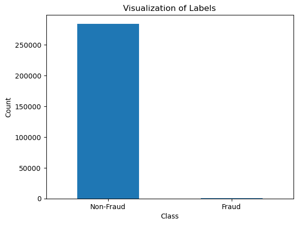
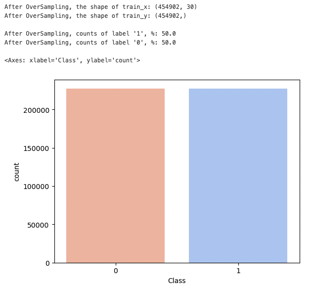
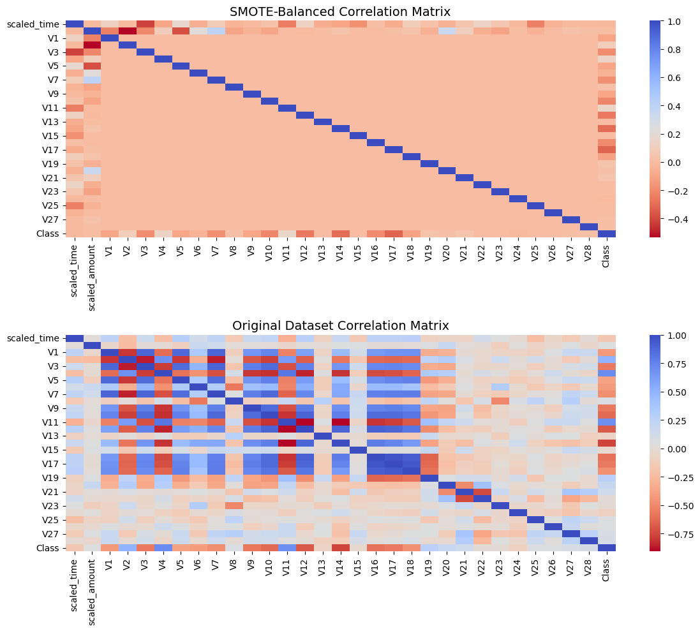
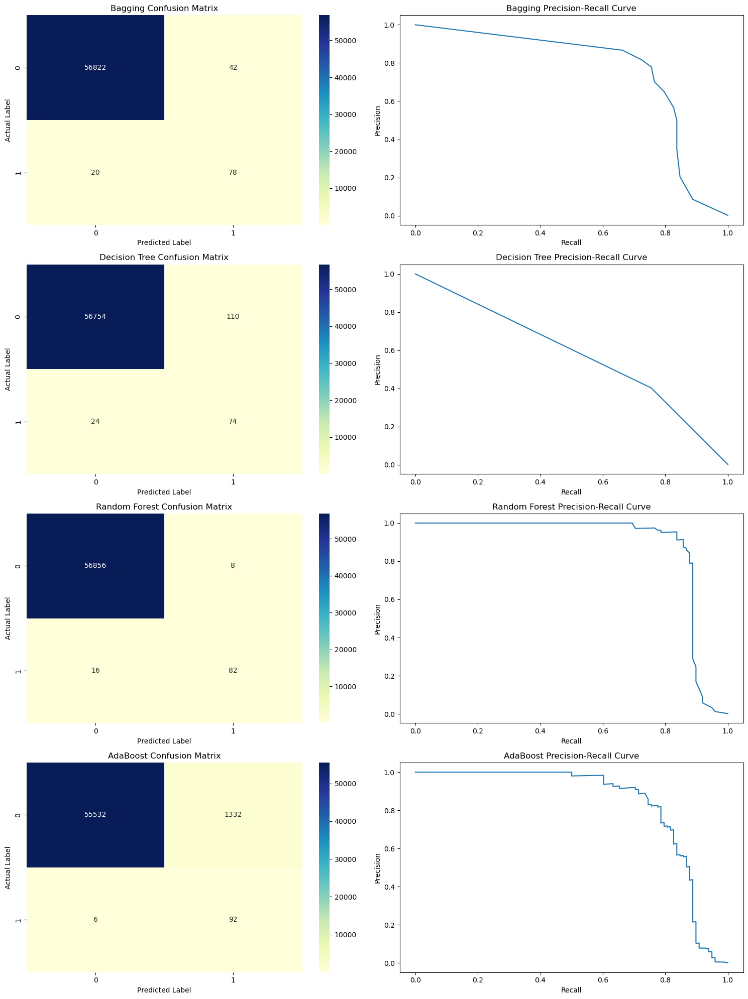
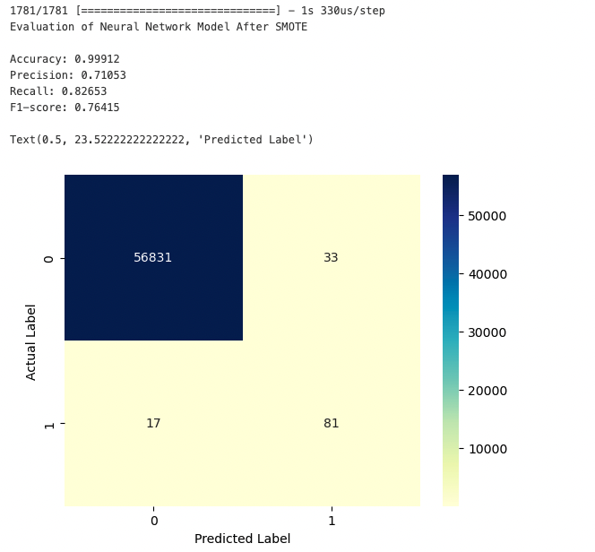

# Credit-Fraud-in-Skewed-Datasets

  

## Project problem and goal: 
With the rise of online shopping and payments, credit card fraud is becoming more common. It's important to utilize machine learning effectively by selecting the appropriate features for detecting fraud. This involves identifying unauthorized use of credit cards for purchases or cash advances, posing a challenge to businesses everywhere to remain vigilant and prevent such activities.

Challenges:

## About the dataset 
- The dataset contains transactions made by credit cards in September 2013 by European cardholders. (Find data [here](https://data.world/raghu543/credit-card-fraud-data))
- It presents transactions occurring over two days, with 492 frauds out of 284,807 transactions. The dataset is highly unbalanced, with the positive class (frauds) accounting for 0.172% of all transactions.
- Dataset Attributes:
  - V1 - V28: Numerical features resulting from PCA transformation.
  - Time: Seconds elapsed between each transaction and the first transaction.
  - Amount: Transaction amount.
  - Class: Indicates fraud or otherwise (1 or 0).
 
    
## Structure of the experiments

1. Exploratory Data Analysis
2. Scaling Features
3. Implementing Oversampling with SMOTE
4. Apply different models after oversampling using SMOTE:
  - BaggingClassifier
  - DecisionTreeClassifier
  - RandomForestClassifier
  - AdaBoostClassifier
  - Neural Network

## Results and Visualizations of the experiments:
**1. Exploratory Data Analysis:** 

- The average transaction amount is about $88
- No missing values in the data
- Non-fraud transactions make up 99.83% of the data, while fraud occurs just 0.17% of the time

  

**2. Scaling Features:** 
Both Time and Amount should be scaled like the other columns.

**3. Decision Justification using Response Surface Methodology:** 
Applying Synthetic Minority Over-sampling Technique (SMOTE) to balance the dataset.

  

Below are the correlation matrices before and after applying SMOTE:

  

**4. Apply different models after oversampling using SMOTE:** 

- Bagging Classifier: High true negatives, low false negatives, indicating good specificity but some cases of fraud may be missed.
- Decision Tree: More false negatives than Bagging, suggesting some fraud is not detected; precision-recall curve declines steadily, reflecting a trade-off between precision and recall.
- Random Forest: Very high true negatives and low false negatives, the best specificity among the models; the precision-recall curve shows high precision across most recall levels.
- AdaBoost: Higher false positives, indicating it incorrectly flagged non-fraud transactions; the precision-recall curve suggests a balance between precision and recall, with a gradual decline.

  

  

**5. Try with Neural Network:** 

The Neural Network has an accuracy of 99.12%, indicating it correctly identifies most transactions. However, its precision is 71.05% and recall is 82.65%, suggesting it's more reliable in detecting fraud than avoiding false alarms. The F1-score of 76.41% reflects a balance between precision and recall. The confusion matrix confirms a high number of correct non-fraud predictions, but with some fraud cases missed, highlighting room for improvement in fraud detection.

  

  

## Conclusion

- Applying the SMOTE technique effectively balanced our previously imbalanced dataset.
- Testing multiple algorithms allowed us to compare their performance.
- The RandomForestClassifier emerged as the top-performing model both before and after applying SMOTE.

Note: Crucial Preliminary Steps:
- Correctly scale features to ensure model accuracy.
- Split data into training and test sets before applying SMOTE to prevent data leakage.

## Files and Directories:
- README.md: Contains the project description.
- images/: Directory containing all images and visualization files.
- Credit_Fraud_code.ipynb: Jupyter Notebook with project code.

## Authors:
- Yen Phan

